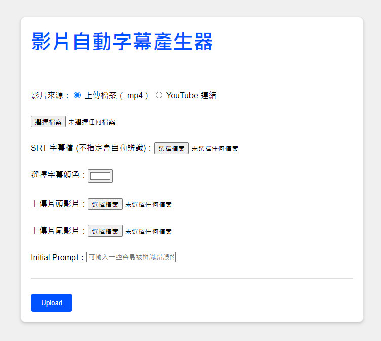

[繁體中文說明](README_zh.md)
[線上版(使用OpenAI API)](https://subgenerator.netlify.app)
# asr-captioner



- Speech Recognition Model: whisper
- Translation Model: Helsinki-NLP/opus-mt-zh-en
- Backend: python flask
- Task Scheduling: celery

Main features include speech recognition, translation, merging subtitles with video, all handled in `task.py`.

## Installation

### Installation using docker-compose

1. The server must have docker, docker-compose, and GPU driver properly installed.

2. Enter the asr-captioner-docker directory:

```
cd asr-captioner-docker
```

3. Navigate to the docker-compose directory and run the following command:

```
docker-compose up -d
```

This will create 3 containers:

- `asr-captioner-web-server`: Main server connection
- `asr-captioner-worker`: Executes tasks including YouTube video downloads, speech recognition, translation, and merging subtitles with the video
- `asr-captioner-redis`: Acts as the broker to distribute tasks

3. Open your browser and enter "http://your.server.ip:7001"
4. To stop the program:

```
docker-compose down
```

### Other Commands

Check the program's running status:

```
docker logs asr-captioner-web-server
docker logs asr-captioner-worker
```

Check user-uploaded files (By default, files will be automatically deleted after processing).

User-uploaded files are stored in `/app/uploads` inside both `asr-captioner-web-server` and `asr-captioner-worker`.

You can check them using the following command:

```
docker exec -it asr-captioner-web-server bash
cd uploads
```
